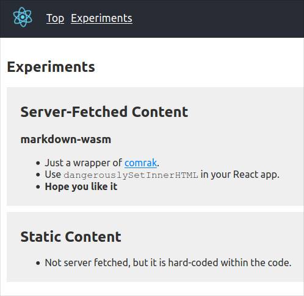

# wasm-pack-react-markdown-example

Use wasm-pack to handle markdown in React app

[1. About](#about)  
[2. What I Did](#what)  
&nbsp; [2-1. Tricks](#what-tricks)  
&nbsp; [2-2. Actual Work](#what-actual-work)  
[3. Development](#dev)  
&nbsp; [3-1. Install](#dev-install)  
&nbsp; [3-2. Run](#dev-run)  
[4. LICENSE](#license)  

*See bellow where texts in markdown are converted to HTML contents*



**IMPORTANT:**  
Please note **THIS PROOJECT IS RELATIVELY OLD**.  
If you are looking for the latest configurations for Rust and Webpack,  
check out my [perlin-experiment](https://github.com/minagawah/perlin-experiment).

<a id="about"></a>
## 1. About

We have a few issues using WASM....

- We want to run **multiple WASM apps in an existing client app.**
- Mounting WASM to a static page is easy, but there are occasions you want to **dynamically import WASM files** (like when you are woking with React apps)
- Sometimes, **you don't want your WASM app to render HTML** but want it to **simply process data being passed.**
- [wasm-pack-plugin](https://github.com/wasm-tool/wasm-pack-plugin) is nice when working with Webpack, but **it does not allow us more than one WASM app per project** (you could, but it can get messy)
- When dealing with DOM elements, [yew](https://yew.rs/docs/) makes your life easier, but **it requires a DOM element to exist when it is loaded** (so it ultimately becomes a choice of Yew or React for managing DOM elements)

so, here are the achievements...

- **Allows multiple WASM modules**
- **No existing DOM for mounting**
- **Dynamically loads WASM modules** in React apps
- The module **simply takes data, returns processed data.** Not messing with HTML rendering.

To illustrate the use, I made a WASM module, called `markdown-wasm`.  
This is just a wrapper of [comrak](https://crates.io/crates/comrak).  
When markdown texts are given, it converts them to HTML (in strings).


<a id="what"></a>
## 2. What I Did


<a id="what-tricks"></a>
### 2-1. Tricks

These are the essential tricks...

- MIME type `application/wasm` for `*.wasm`
- `--target web` when building with [wasm-pack](https://github.com/rustwasm/wasm-pack)
- `yarn link` so that React can lookup the WASM module.
- Using [wasm-loader](https://github.com/ballercat/wasm-loader) to load `*.wasm` files
- Use of [babel-plugin-bundled-import-meta](https://github.com/cfware/babel-plugin-bundled-import-meta) to support `import.meta` syntax.


<a id="what-actual-work"></a>
### 2-2. Actual Work

Rather than explaining the details in length,
I thought it would be easier to illustrate actual work I did.

#### [Step 1] Creating a React app

Create a new app using [CRA](https://github.com/facebook/create-react-app).
```shell
yarn create react-app wasm-pack-react-markdown-example
yarn add react-router-dom
```

#### [Step 2] Overriding Webpack Loaders

```shell
yarn add react-app-rewired customize-cra --dev
```

Here, I show you what configured in `config-overrides.js`.  
It is quite long... yes.  
I will explain later what it means for each.

`config-overrides.js`  
```js
const path = require('path');
const {
  override,
  overrideDevServer,
  addExternalBabelPlugin,
} = require('customize-cra');

const wasmOutDir = path.resolve(__dirname, 'wasm');

const addWasmHandler = config => {
  config.resolve.extensions.push('.wasm');

  // Exclusion in `file-loader`.
  // If you are NOT using CRA, this is not needed.
  config.module.rules.forEach(rule => {
    (rule.oneOf || []).forEach(o => {
      if (o.loader && o.loader.indexOf('file-loader') >= 0) {
        o.exclude.push(/\.wasm$/);
      }
    });
  });

  config.module.rules.push({
    test: /\.wasm$/,
    include: wasmOutDir,
    use: [
      {
        loader: require.resolve('wasm-loader'),
      },
    ],
  });

  return config;
};

const devServerConfig = config => ({
  ...config,
  before: app => {
    app.get('*.wasm', (req, res, next) => {
      const options = {
        root: path.resolve(__dirname),
        dotfiles: 'deny',
        headers: {
          'Content-Type': 'application/wasm',
        },
      };
      res.sendFile(req.url, options, err => {
        if (err) {
          console.warn(err);
          next(err);
        }
      });
    });
  },
});

module.exports = {
  webpack: override(
    addWasmHandler,
    addExternalBabelPlugin([
      'babel-plugin-bundled-import-meta',
      {
        // You need to specify "bundleDir" if
        // your built WASM directory is different
        // from your Webpack bundle directory.
        //
        // bundleDir: [PUBLIC_PATH_TO_YOUR_BUILT_WASM_DIRECTORY]
        importStyle: 'cjs',
      },
    ]),
    // Just adding an alias '@'.
    config => {
      config.resolve.alias['@'] = path.join(__dirname, 'src');
      return config;
    }
  ),
  devServer: overrideDevServer(devServerConfig),
};
```

So, that was quite a bit.

Here, with `config-overrides.js`, we are doing 3 things.


##### (a) "addWasmHandler": Using `wasm-loader`

For `*.wasm` files, instead of `file-loader`, we are using [wasm-loader](https://github.com/ballercat/wasm-loader).  
`addWasmHandler` simply alter the loader configuration.  
(if you are NOT using CRA, you don't need the exclusion for `file-loader`).


##### (b) "devServerConfig": `application/wasm` MIME Type

Once again, we we take at one of the WASM files, we see the following:

`wasm/markdown-wasm/wasm.js`  
```js
if (typeof WebAssembly.instantiateStreaming === 'function') {
    try {
        return await WebAssembly.instantiateStreaming(module, imports);
    } catch (e) {
        if (module.headers.get('Content-Type') != 'application/wasm') {
            console.warn("`WebAssembly.instantiateStreaming` failed
because your server does not serve wasm with `application/wasm` MIME type.
Falling back to `WebAssembly.instantiate` which is slower. Original error:\n", e);
        } else {
            throw e;
        }
    }
}
```
it says that we need a special MIME type `application/wasm` to serve `*.wasm` files.
So, with `addWasmHandler`, we are overriding `devServer` config.


##### (c) "addExternalBabelPlugin": Resolving `import.meta` Syntax

If you take a look at one of our WASM files, we have the following:

`wasm/markdown-wasm/wasm.js`  
```js
if (typeof input === 'undefined') {
    input = import.meta.url.replace(/\.js$/, '_bg.wasm');
}
```
where `import.meta` is a syntax which Webpack has a trouble understanding.
So, I need a corresponding polyfill.
```
yarn add --dev babel-plugin-bundled-import-meta
```
We are using `addExternalBabelPlugin` to configure Babel to handle `import.meta`.  
(as it says in the comments, use `bundleDir` if you serve WASM in different directory)


#### [Step 3] Creating WASM Source Directory (`src_for_wasm`)

Source codes are stored inside `src_for_wasm` directory.
Instead of manually setting up a new Cargo project, I used
[wasm-pack-template](https://rustwasm.github.io/wasm-pack/book/tutorials/npm-browser-packages/getting-started.html), and typed `markedown-wasm` for the project name.
```shell
mkdir src_for_wasm
cd src_for_wasm
cargo generate --git https://github.com/rustwasm/wasm-pack-template
(it asks for a project name, so I typed "markdown-wasm")
> markdown-wasm
```

#### [Step 4] Creating WASM Build Directory (`wasm`)

While `wasm-pack build` will automatically create a build directory for you,
in order for a symlink to work (discussed later),
I need to manually prepare build the directory.
```shell
mkdir wasm
mkdir wasm/markdown-wasm
touch wasm/markdown-wasm/.gitignore
```

#### [Step 5] Making a Build Script & Run

Here is the script:
`build.sh`  
```shell
wasm-pack build "$PROFILE" --target web --out-name wasm --out-dir "$OUT_DIR/"
```
and to run it:
```shell
sh ./build.sh markdown-wasm
```
now, it outputs the compiled WASM files to `wasm/markdown-wasm` directory.
```shell
$ ls -1 wasm/markdown-wasm/
package.json
README.md
wasm_bg.d.ts
wasm_bg.wasm
wasm.d.ts
wasm.js
```

#### [Step 6] Creating a Symlink from React to WASM

Register a symlink under WASM source directory:
```shell
cd wasm/markdown-wasm
yarn link
```
`npm link` if you are not using `yarn`.
Since we already generated `package.json` beforehand,
it can register the symlink with its name "markdown-wasm".

Now, I go to React source directory, and link it to the one just registered:
```shell
cd src
yarn link "markdown-wasm"
```


#### [Step 7] Dynamically Import WASM Module

Since `build.sh` script runs `wasm-pack build` with `--target web` option,
I can asynchronously load my WASM module easily.

`src/components/articles/index.jsx`
```js
import React, { useState, useEffect, useContext } from 'react';
import init, { render_markdown } from 'markdown-wasm';

import { ArticleContext } from '@/contexts/article_context';
import { Loading } from '@/components/loading';

import { Item } from './item';

const anotherContent = `## Static Content
- Not server fetched, but it is hard-coded within the code.`;

export const Articles = () => {
  const [articles, dispatch] = useContext(ArticleContext);
  const [moduleLoading, setModuleLoading] = useState(false);
  const [moduleReady, setModuleReady] = useState(false);

  useEffect(() => {
    (async () => {
      try {
        dispatch({ type: 'RELOAD_ARTICLES' });
        setModuleLoading(true);
        await init();
        setModuleReady(true);
      } catch (err) {
        console.error(err);
        setModuleLoading(false);
      }
    })();
  }, [dispatch]);

  return (
    <div>
      {moduleReady && articles.data.length ? (
        <>
          <Item renderMarkdown={render_markdown}>{articles.data[0]}</Item>
          <Item renderMarkdown={render_markdown}>{anotherContent}</Item>
        </>
      ) : (
        <Loading loading={moduleLoading} />
      )}
    </div>
  );
};
```

#### [Extra] Absolute Path (for React Components)

Because I have `.env` file with NODE_ENV specifying the app root directory to be `src`,
I no longer have to import React components using relative path, but now using absolute path.  
`.env`
```
NODE_PATH=src/
```


<a id="dev"></a>
## 3. Development

**IMPORTANT: When you install, you need to build the WASM, and create a yarn link.**


<a id="dev-install"></a>
### 3-1. Install

(1) You first need to `yarn install`.

```shell
> git clone https://github.com/minagawah/wasm-pack-react-markdown-example.git
> cd wasm-pack-react-markdown-example
> yarn install
```

(2) Then, **you need to build the WASM.**

```shell
> yarn build:wasm
```

the above simply runs `sh ./build.sh markdown-wasm`


(3) Finally, **you need to create a symlink (yarn link).**

```shell
# First, create a yarn link in the built directory.
> cd wasm/markdown-wasm
> yarn link

yarn link v1.22.5
warning package.json: No license field
warning package.json: No license field
success Registered "markdown-wasm".
info You can now run `yarn link "markdown-wasm"` in the projects where you want to use this package and it will be used instead.
Done in 0.10s

# Secondly, in the source directory, use the link just created.
> cd src
> yarn link "markdown-wasm"
yarn link v1.22.5
success Using linked package for "markdown-wasm".
Done in 0.08s.

# Check if you successfully created the yarn link.
> cd node_modules
> ls -la | grep '^l'
-------------------------------------------------------
lrwxrwxrwx    1 mina mina     46 Oct 26 18:57 markdown-wasm -> [PATH_TO_THE_LINK]/.config/yarn/link/markdown-wasm
-------------------------------------------------------
```


<a id="dev-run"></a>
### 3-1. Run

```shell
yarn start
```

Runs a React app in development mode.  
http://localhost:3000


<a id="license"></a>
## 4. License

Dual-licensed under either of the followings.  
Choose at your option.

- The UNLICENSE ([LICENSE.UNLICENSE](LICENSE.UNLICENSE))
- MIT license ([LICENSE.MIT](LICENSE.MIT))

`markdown-wasm` is a wrapper of [comrak](https://crates.io/crates/comrak).  
Copyright (c) 2017–2020, Ashe Connor. Licensed under the 2-Clause BSD License.  
cmark itself is is copyright (c) 2014, John MacFarlane.  
See their [LEGAL](https://github.com/kivikakk/comrak/blob/HEAD/COPYING) notes.

